# 🧠 Agentic AI  
*Modern Engineer Toolkit — Agent Systems Track*

Agentic AI is the layer **above LLMs** that turns models into *actors* — systems that plan, use tools, call APIs, reason over steps, collaborate with other agents, and execute workflows autonomously.

This section covers:  
- Tool-use & function calling  
- ReAct logic (Reason + Act)  
- Memory systems  
- Planning & multi-step reasoning  
- Multi-agent systems  
- LangChain / LangGraph / CrewAI  
- OpenAI’s Agent tools & function-calling  
- Real-world agent architectures  
- Projects & workflows  

📌 **Looking for Generative AI (LLMs, Transformers, RAG, Fine-tuning)?**  
➡️ `../GenerativeAI/README.md`

---

# ⚡ Quick Links

- **Prerequisites** → [GenAI](../GenerativeAI/README.md), [Deep Learning](../DeepLearning/README.md)  
- **Core Concepts** → [Agent Foundations](#-1-agent-foundations)  
- **Tool Use** → [Tools & Function Calling](#-2-tool--function-calling)  
- **Memory** → [Memory Systems](#-3-memory-systems)  
- **Planning** → [ReAct & Planning](#-4-react-planning--multi-step-reasoning)  
- **Frameworks** → [Agent Frameworks](#-6-agent-frameworks-langchain-langgraph-crewai)  
- **Multi-Agent Systems** → [MAS](#-5-multi-agent-systems)  
- **Projects** → [Projects](#-8-projects-beginner--advanced)  

---

# 🧱 Prerequisites

Before learning Agentic AI, complete:

- **Generative AI** → LLMs, RAG, embeddings  
- **Python** → scripting, APIs  
- **Deep Learning** → high-level understanding  
- **Transformers** → attention, inference basics  

Agents depend heavily on LLM capabilities.

---

# 🗺️ High-Level Roadmap (Agentic AI)

```mermaid
flowchart TD

    A[Generative AI<br/>LLMs · RAG · Embeddings] --> B[Tool Use<br/>Function Calling]
    B --> C[Memory<br/>Short-term · Long-term]
    C --> D[Planning<br/>ReAct · Task Decomposition]
    D --> E[Agent Execution<br/>Loops · Monitoring]
    E --> F[Multi-Agent Systems<br/>Supervisor · Workers]
    F --> G[Applications<br/>Automation · Assistants · Pipelines]
```

## 🧠 1. Agent Foundations

Agentic AI = LLM + Memory + Tools + Planning + Execution Loop
### Core ideas
Agents decide actions, not just generate text
They use tools: APIs, DBs, code interpreters
They maintain state: episodic + semantic memory
They can self-reflect, critique, and replan
They can chain multiple LLM calls in loops

### Agent Loop (general pattern)
1. Observe
2. Think (internal reasoning)
3. Act (tool)
4. Read tool output
5. Update memory
6. Continue or stop

## 🛠️ 2. Tool & Function Calling
Tools an agent can use:

- Web search
- Python interpreter
- Database queries
- External APIs
- Retrieval systems
- Browsing
- Executing code
- File system

### Top frameworks for tool-use:
- OpenAI Function Calling
- OpenAI Assistants API (Tools)
- LangChain Tools
- LangGraph tool nodes
- CrewAI tools system

## 🧩 3. Memory Systems

### Memory lets an agent remember:

- previous tasks
- user context
- documents
- plans
- results

### Memory types:
| Type                  | Purpose                         |
| --------------------- | ------------------------------- |
| **Short-term memory** | Chat history, local context     |
| **Long-term memory**  | Vector DB, embeddings           |
| **Semantic memory**   | Facts & knowledge               |
| **Episodic memory**   | Past actions & decisions        |
| **Working memory**    | For planning & chain-of-thought |
