# 🧠 Agentic AI  
*Modern Engineer Toolkit — Agent Systems Track*

Agentic AI is the layer **above LLMs** that turns models into *actors* — systems that plan, use tools, call APIs, reason over steps, collaborate with other agents, and execute workflows autonomously.

This section covers:  
- Tool-use & function calling  
- ReAct logic (Reason + Act)  
- Memory systems  
- Planning & multi-step reasoning  
- Multi-agent systems  
- LangChain / LangGraph / CrewAI  
- OpenAI’s Agent tools & function-calling  
- Real-world agent architectures  
- Projects & workflows  

📌 **Looking for Generative AI (LLMs, Transformers, RAG, Fine-tuning)?**  
➡️ `../GenerativeAI/README.md`

---

# ⚡ Quick Links

- **Prerequisites** → [GenAI](../GenerativeAI/README.md), [Deep Learning](../DeepLearning/README.md)  
- **Core Concepts** → [Agent Foundations](#-1-agent-foundations)  
- **Tool Use** → [Tools & Function Calling](#-2-tool--function-calling)  
- **Memory** → [Memory Systems](#-3-memory-systems)  
- **Planning** → [ReAct & Planning](#-4-react-planning--multi-step-reasoning)  
- **Frameworks** → [Agent Frameworks](#-6-agent-frameworks-langchain-langgraph-crewai)  
- **Multi-Agent Systems** → [MAS](#-5-multi-agent-systems)  
- **Projects** → [Projects](#-8-projects-beginner--advanced)  

---

# 🧱 Prerequisites

Before learning Agentic AI, complete:

- **Generative AI** → LLMs, RAG, embeddings  
- **Python** → scripting, APIs  
- **Deep Learning** → high-level understanding  
- **Transformers** → attention, inference basics  

Agents depend heavily on LLM capabilities.

---

# 🗺️ High-Level Roadmap (Agentic AI)

```mermaid
flowchart TD

    A[Generative AI<br/>LLMs · RAG · Embeddings] --> B[Tool Use<br/>Function Calling]
    B --> C[Memory<br/>Short-term · Long-term]
    C --> D[Planning<br/>ReAct · Task Decomposition]
    D --> E[Agent Execution<br/>Loops · Monitoring]
    E --> F[Multi-Agent Systems<br/>Supervisor · Workers]
    F --> G[Applications<br/>Automation · Assistants · Pipelines]
```

## 🧠 1. Agent Foundations

Agentic AI = LLM + Memory + Tools + Planning + Execution Loop
### Core ideas
Agents decide actions, not just generate text
They use tools: APIs, DBs, code interpreters
They maintain state: episodic + semantic memory
They can self-reflect, critique, and replan
They can chain multiple LLM calls in loops

### Agent Loop (general pattern)
1. Observe
2. Think (internal reasoning)
3. Act (tool)
4. Read tool output
5. Update memory
6. Continue or stop

## 🛠️ 2. Tool & Function Calling
Tools an agent can use:

- Web search
- Python interpreter
- Database queries
- External APIs
- Retrieval systems
- Browsing
- Executing code
- File system

### Top frameworks for tool-use:
- OpenAI Function Calling
- OpenAI Assistants API (Tools)
- LangChain Tools
- LangGraph tool nodes
- CrewAI tools system

## 🧩 3. Memory Systems

### Memory lets an agent remember:

- previous tasks
- user context
- documents
- plans
- results

### Memory types:
| Type                  | Purpose                         |
| --------------------- | ------------------------------- |
| **Short-term memory** | Chat history, local context     |
| **Long-term memory**  | Vector DB, embeddings           |
| **Semantic memory**   | Facts & knowledge               |
| **Episodic memory**   | Past actions & decisions        |
| **Working memory**    | For planning & chain-of-thought |

### Tools:

- Chroma
- LanceDB
- Weaviate
- Pinecone
- LangGraph Checkpoints
- CrewAI Memory

## 🔁 4. ReAct, Planning & Multi-Step Reasoning

### ReAct = Reason + Act

#### Agents generate:

- thoughts
- decisions
- next actions
- reflections

### Planning techniques:

ReAct

- Chain-of-thought
- Self-reflection
- Task decomposition
- Planner–executor agents
- Tactic agents + strategies

### Frameworks supporting planning:

- LangGraph (state machines + workflows)
- CrewAI (hierarchical agents)
- AutoGen (multi-agent reasoning)

## 👥 5. Multi-Agent Systems

Multiple agents collaborate like teams.

### Types:

- Supervisor → Worker agents
- Debate agents
- Critic + Solver
- Router agents
- Evaluator agents

### Use cases:

- Research automation
- Multi-step pipelines
- Code generation & testing
- Enterprise workflow automation

## 🏗️ 6. Agent Frameworks (LangChain, LangGraph, CrewAI)
### LangChain

Great for:

- Tools
- RAG
- Chains
- Simple agents

▶️ Tutorials:
https://youtube.com/playlist?list=PLKnIA16_RmvaTbihpo4MtzVm4XOQa0ER0

### LangGraph (most powerful)

- Graph-based agent orchestration:
- Persistent state
- Checkpointing
- Multi-agent workflows
- Robust planning
- Production-grade

▶️ Tutorials:
https://youtube.com/playlist?list=PLKnIA16_RmvYsvB8qkUQuJmJNuiCUJFPL

### CrewAI

- Agent “teams” with:
- Roles
- Goals
- Tools
- Memory

Supports long-running autonomous pipelines.

▶️ CrewAI Docs
https://crewai.com/

### OpenAI Assistants / Agents

Native:
- Tools
- Retrieval
- Code interpreter
- Multi-step function calls
- File management

Great for production.

## 🧰 7. Tools & Infrastructure
| Category         | Tools                                   |
| ---------------- | --------------------------------------- |
| Vector DBs       | Chroma, LanceDB, Pinecone, Weaviate     |
| Agent frameworks | LangChain, LangGraph, CrewAI, AutoGen   |
| Execution        | FastAPI, Cloudflare Workers, AWS Lambda |
| Monitoring       | LangSmith, Weights & Biases             |
| Storage          | Supabase, MongoDB, Postgres             |
| Hosting          | Vercel, Render, AWS, GCP                |

## 8. Projects (Beginner → Advanced)
### Beginner

- Tool-using chatbot (search + calculator)
- Simple RAG agent
- Memory-based personal assistant

### Intermediate

- Research agent (web search + summarization)
- Multi-tool workflow agent (PDFs, browsing, code)
- Planning agent with ReAct + memory

### Advanced

- Multi-agent research team (Supervisor + Analysts)
- Automated software engineer (code → test → fix loop)
- Enterprise workflow automation (email → tasks → reports)
- Robotics agent interface (planning + perception + control)

## 🧭 9. Recommended Learning Path

Learn Generative AI (LLMs, RAG, embeddings)
Understand tool-calling (OpenAI / LangChain)
Add memory (vector DB + episodic memory)
Learn ReAct + planning
Build your first agent loop
Add multi-agent collaboration
Deploy + monitor with LangGraph
Build complex pipelines

## 🔗 Cross-Links

- Generative AI → ../GenerativeAI/README.md
- Deep Learning → ../DeepLearning/README.md
- ML → ../MachineLearning/README.md
- Fundamentals → ../Fundamentals/README.md
