# 🧠 Agentic AI  
*Modern Engineer Toolkit — Agent Systems Track*

Agentic AI is the layer **above LLMs** that turns models into *actors* — systems that plan, use tools, call APIs, reason over steps, collaborate with other agents, and execute workflows autonomously.

This section covers:  
- Tool-use & function calling  
- ReAct logic (Reason + Act)  
- Memory systems  
- Planning & multi-step reasoning  
- Multi-agent systems  
- LangChain / LangGraph / CrewAI  
- OpenAI’s Agent tools & function-calling  
- Real-world agent architectures  
- Projects & workflows  

📌 **Looking for Generative AI (LLMs, Transformers, RAG, Fine-tuning)?**  
➡️ `../GenerativeAI/README.md`

---

# ⚡ Quick Links

- **Prerequisites** → [GenAI](../GenerativeAI/README.md), [Deep Learning](../DeepLearning/README.md)  
- **Core Concepts** → [Agent Foundations](#-1-agent-foundations)  
- **Tool Use** → [Tools & Function Calling](#-2-tool--function-calling)  
- **Memory** → [Memory Systems](#-3-memory-systems)  
- **Planning** → [ReAct & Planning](#-4-react-planning--multi-step-reasoning)  
- **Frameworks** → [Agent Frameworks](#-6-agent-frameworks-langchain-langgraph-crewai)  
- **Multi-Agent Systems** → [MAS](#-5-multi-agent-systems)  
- **Projects** → [Projects](#-8-projects-beginner--advanced)  

---

# 🧱 Prerequisites

Before learning Agentic AI, complete:

- **Generative AI** → LLMs, RAG, embeddings  
- **Python** → scripting, APIs  
- **Deep Learning** → high-level understanding  
- **Transformers** → attention, inference basics  

Agents depend heavily on LLM capabilities.

---

# 🗺️ High-Level Roadmap (Agentic AI)

```mermaid
flowchart TD

    A[Generative AI<br/>LLMs · RAG · Embeddings] --> B[Tool Use<br/>Function Calling]
    B --> C[Memory<br/>Short-term · Long-term]
    C --> D[Planning<br/>ReAct · Task Decomposition]
    D --> E[Agent Execution<br/>Loops · Monitoring]
    E --> F[Multi-Agent Systems<br/>Supervisor · Workers]
    F --> G[Applications<br/>Automation · Assistants · Pipelines]
```

