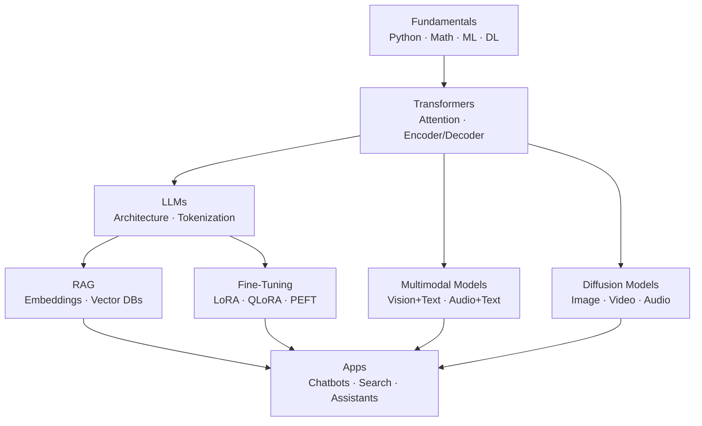

# 🤖 Generative AI & LLMs  
*Modern Engineer Toolkit — GenAI Track*

Generative AI builds on **Deep Learning + Transformers** to power ChatGPT, Claude, Gemini, diffusion models, and multimodal systems.

This section covers:  
- Transformers  
- LLM fundamentals  
- Tokenization & embeddings  
- RAG systems  
- Fine-tuning (LoRA/QLoRA/PEFT)  
- Diffusion models  
- Multimodal models (VLMs, audio, video)  
- Frameworks: HuggingFace, LangChain, LangGraph  
- Projects & resources  

📌 **Looking for Agentic AI (tools, planning, autonomous agents)?**  
➡️ `../AgenticAI/README.md`

---

# ⚡ Quick Links

- **Prerequisites** → [Fundamentals](../Fundamentals/README.md), [ML](../MachineLearning/README.md), [Deep Learning](../DeepLearning/README.md)  
- **Transformers** → [Transformers](#-2-transformers-the-core-of-genai)  
- **LLMs** → [LLMs](#-3-large-language-models-llms)  
- **RAG** → [RAG](#-4-rag-retrieval-augmented-generation)  
- **Fine-tuning** → [Fine-tuning](#-5-fine-tuning-lora--qlora--peft)  
- **Diffusion** → [Diffusion Models](#-6-diffusion-models-images--video)  
- **Multimodal** → [Multimodal Models](#-7-multimodal-models-vlms-audio-video)  
- **Projects** → [Projects](#-9-projects-beginner--advanced)  

---

# 🧱 Prerequisites

Before learning Generative AI, complete:

- **Python** → `../Fundamentals/README.md#1-python`
- **Math + Data Basics** → `../Fundamentals/README.md`
- **Machine Learning** → `../MachineLearning/README.md`
- **Deep Learning** → `../DeepLearning/README.md`

---

# 🗺️ High-Level Roadmap (Generative AI)

##🎓 1. Core Free Generative AI Courses

| Course                                        | Description                                          | Link                                                                           |
| --------------------------------------------- | ---------------------------------------------------- | ------------------------------------------------------------------------------ |
| NVIDIA GenAI & LLM Learning Paths             | Full LLM, RAG, diffusion, deployment tracks          | ▶️ [Link](https://www.nvidia.com/en-us/learn/learning-path/generative-ai-llm)  |
| Microsoft Learn — Generative AI for Beginners | 18-lesson series: fundamentals → apps → RAG → agents | ▶️ [Link](https://learn.microsoft.com/en-us/shows/generative-ai-for-beginners) |
| DeepLearning.AI GenAI Courses                 | LLMs, LangChain, RAG, agents, safety                 | ▶️ [Link](https://www.deeplearning.ai/courses)                                 |
| Google Cloud GenAI Learning Path              | GenAI basics, prompt design, building LLM apps       | ▶️ Google Skill Boost                                                          |

## 🧩 2. Transformers (The Core of GenAI)

Transformers power:

LLMs
Diffusion models
Vision transformers
Audio + speech models
Multimodal systems

Key Concepts

Attention
Self-attention
Multi-head attention
Encoder / decoder stacks
Positional encoding
Feed-forward blocks

Layer normalization
