# 🤖 Generative AI & LLMs  
*Modern Engineer Toolkit — GenAI Track*

Generative AI builds on **Deep Learning + Transformers** to power ChatGPT, Claude, Gemini, diffusion models, and multimodal systems.

This section covers:  
- Transformers  
- LLM fundamentals  
- Tokenization & embeddings  
- RAG systems  
- Fine-tuning (LoRA/QLoRA/PEFT)  
- Diffusion models  
- Multimodal models (VLMs, audio, video)  
- Frameworks: HuggingFace, LangChain, LangGraph  
- Projects & resources  

📌 **Looking for Agentic AI (tools, planning, autonomous agents)?**  
➡️ `../AgenticAI/README.md`

---

# ⚡ Quick Links

- **Prerequisites** → [Fundamentals](../Fundamentals/README.md), [ML](../MachineLearning/README.md), [Deep Learning](../DeepLearning/README.md)  
- **Transformers** → [Transformers](#-2-transformers-the-core-of-genai)  
- **LLMs** → [LLMs](#-3-large-language-models-llms)  
- **RAG** → [RAG](#-4-rag-retrieval-augmented-generation)  
- **Fine-tuning** → [Fine-tuning](#-5-fine-tuning-lora--qlora--peft)  
- **Diffusion** → [Diffusion Models](#-6-diffusion-models-images--video)  
- **Multimodal** → [Multimodal Models](#-7-multimodal-models-vlms-audio-video)  
- **Projects** → [Projects](#-9-projects-beginner--advanced)  

---

# 🧱 Prerequisites

Before learning Generative AI, complete:

- **Python** → `../Fundamentals/README.md#1-python`
- **Math + Data Basics** → `../Fundamentals/README.md`
- **Machine Learning** → `../MachineLearning/README.md`
- **Deep Learning** → `../DeepLearning/README.md`

---

# 🗺️ High-Level Roadmap (Generative AI)

```mermaid
flowchart TD

    A[Fundamentals<br/>Python · Math · ML · DL] --> B[Transformers<br/>Attention · Encoder/Decoder]

    B --> C[LLMs<br/>Architecture · Tokenization]
    B --> D[Diffusion Models<br/>Image · Video · Audio]
    B --> E[Multimodal Models<br/>Vision+Text · Audio+Text]

    C --> F[RAG<br/>Embeddings · Vector DBs]
    C --> G[Fine-Tuning<br/>LoRA · QLoRA · PEFT]

    F --> H[Apps<br/>Chatbots · Search · Assistants]
    G --> H
    E --> H
    D --> H
```

##🎓 1. Core Free Generative AI Courses

| Course                                        | Description                                          | Link                                                                           |
| --------------------------------------------- | ---------------------------------------------------- | ------------------------------------------------------------------------------ |
| NVIDIA GenAI & LLM Learning Paths             | Full LLM, RAG, diffusion, deployment tracks          | ▶️ [Link](https://www.nvidia.com/en-us/learn/learning-path/generative-ai-llm)  |
| Microsoft Learn — Generative AI for Beginners | 18-lesson series: fundamentals → apps → RAG → agents | ▶️ [Link](https://learn.microsoft.com/en-us/shows/generative-ai-for-beginners) |
| DeepLearning.AI GenAI Courses                 | LLMs, LangChain, RAG, agents, safety                 | ▶️ [Link](https://www.deeplearning.ai/courses)                                 |
| Google Cloud GenAI Learning Path              | GenAI basics, prompt design, building LLM apps       | ▶️ Google Skill Boost                                                          |

## 🧩 2. Transformers (The Core of GenAI)

Transformers power:

LLMs
Diffusion models
Vision transformers
Audio + speech models
Multimodal systems

Key Concepts

Attention
Self-attention
Multi-head attention
Encoder / decoder stacks
Positional encoding
Feed-forward blocks
Layer normalization

| Topic                  | Description                    | Link                                    |
| ---------------------- | ------------------------------ | --------------------------------------- |
| HF Transformers Course | Tokenizers → models → training | ▶️ [Link](https://huggingface.co/learn) |

## 🧠 3. Large Language Models (LLMs)
Core Concepts

Tokenization (BPE, SentencePiece)
Context windows
Scaling laws
Prompting fundamentals
Quantization (4-bit, 8-bit)
Efficient inference

| Topic      | Description                            | Link                                               |
| ---------- | -------------------------------------- | -------------------------------------------------- |
| LLM Course | Training, fine-tuning, evaluation      | ▶️ [Link](https://huggingface.co/learn/llm-course) |
| Model Hub  | Open-source LLMs (Llama, Mistral, Phi) | 🔗 [Link](https://huggingface.co/models)           |

## 🔍4. RAG (Retrieval-Augmented Generation)

RAG = Search → Retrieve → Augment → Generate

Learn:
Chunking strategies
Embeddings
Vector databases
Query transformations
Document reranking
Evaluation
| Topic                   | Description                          | Link                                                                            |
| ----------------------- | ------------------------------------ | ------------------------------------------------------------------------------- |
| LangChain RAG Tutorials | Full RAG pipelines                   | ▶️ [Link](https://youtube.com/playlist?list=PLKnIA16_RmvaTbihpo4MtzVm4XOQa0ER0) |
| HF RAG Course           | Embeddings → vector DBs → generation | ▶️ [Link](https://huggingface.co/learn)                                         |

## 🔧 5. Fine-Tuning (LoRA / QLoRA / PEFT)

Fine-tuning Types
LoRA — low-rank adapters
QLoRA — fine-tuning 4-bit LLMs
PEFT — efficient tuning
Full fine-tuning — rarely needed

| Topic                 | Description                     | Link                                              |
| --------------------- | ------------------------------- | ------------------------------------------------- |
| Fine-Tuning with LoRA | Practical LoRA + QLoRA tutorial | ▶️ YouTube                                        |
| HF PEFT Docs          | Official PEFT library           | 🔗 [Link](https://huggingface.co/docs/peft/index) |

## 🌫️ 6. Diffusion Models (Images & Video)

Diffusion models generate:
Images (Stable Diffusion)
Videos (SORA-style models)
Audio
3D scenes

### Learn:
Forward diffusion
Reverse denoising process
U-Net backbones
Classifier-free guidance
Latent diffusion

| Resource                                | Description                                | Link                                                              |
| --------------------------------------- | ------------------------------------------ | ----------------------------------------------------------------- |
| DGAI — Learn GenAI with PyTorch         | GANs → VAEs → GPT → Diffusion              | ▶️ [Link](https://github.com/markhliu/DGAI)                       |
| Generative Deep Learning (David Foster) | VAEs, GANs, flows, transformers, diffusion | Book                                                              |
| Awesome Diffusion Models                | Curated repo of papers + code              | ▶️ [Link](https://github.com/diff-usion/Awesome-Diffusion-Models) |

## 🧿 7. Multimodal Models (VLMs, Audio, Video)
Types

VLMs: CLIP, LLaVA, BLIP-2
Audio models: Whisper, AudioLM
Video models: SORA-style diffusion
Concepts
Cross-attention
Feature alignment
Vision encoders (ViT)
Projection heads

## 🧰 8. Frameworks & Tools
| Category   | Tools                                         |
| ---------- | --------------------------------------------- |
| LLMs       | HuggingFace Transformers, OpenAI API, vLLM    |
| RAG        | LangChain, LlamaIndex, LanceDB, Chroma        |
| Agents     | LangGraph, CrewAI *(full guide in AgenticAI)* |
| Serving    | FastAPI, TGI, DeepSpeed, Ollama               |
| Diffusion  | HF Diffusers, ComfyUI, Automatic1111          |
| Evaluation | RAGAS, lm-eval-harness                        |

## 🧪 9. Projects (Beginner → Advanced)
### Beginner

Build a chatbot (OpenAI/HF)
Embeddings + vector search
Basic RAG pipeline

### Intermediate
Fine-tune a model with LoRA

Document QA system
Personal AI assistant
Text-to-image UI with Diffusers

### Advanced

Multimodal chatbot (image + text)
Video generation pipeline
Domain-specific RAG with rerankers
LLM-powered coding assistant

## 🧭 10. Recommended Learning Path

1. Learn Transformers
2. Understand LLM architecture
3. Master tokenization + embeddings
4. Build RAG systems
5. Learn fine-tuning (LoRA/QLoRA)
6. Explore diffusion models
7. Build multimodal applications
8. Move to Agentic AI for autonomous systems

   
## 🔗 Cross-Links

Deep Learning → ../DeepLearning/README.md
Fundamentals → ../Fundamentals/README.md
Machine Learning → ../MachineLearning/README.md
Agentic AI → ../AgenticAI/README.md
✔️ End of Generative AI Module
