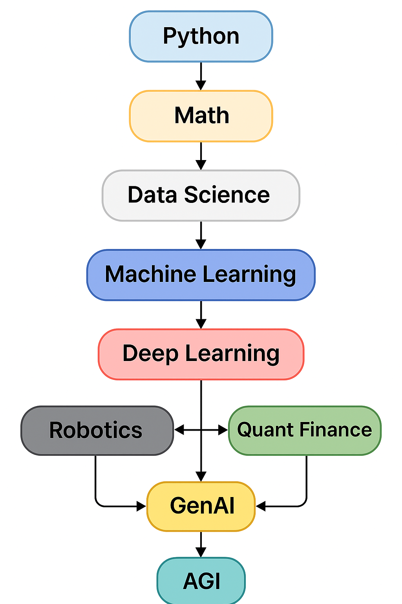

# 🌟 THE MODERN ENGINEER TOOLKIT – Curated Resource Hub

### • [Twitter](https://x.com/) • [GitHub](https://github.com/) • [HuggingFace](https://huggingface.co)

# 🧠 About This Toolkit
Modern engineering is built across several interconnected fields — Machine Learning, Deep Learning, GenAI, Robotics, Quant Finance, and AGI.
This toolkit gives you:
- A complete learning map  
- 100+ curated resource links  
- Connective understanding between fields  
- Beginner → Advanced pathways  
- Sub-READMEs for deep dives into each domain  

---

# 🌐 Overview of Fields
### 📘 Machine Learning  
Foundations of algorithms, predictive modeling, and data workflows.

### 🔥 Deep Learning  
Neural networks, vision, NLP, and the backbone of GenAI.

### 🤖 Generative AI & LLMs  
Transformers, RAG, agents, fine-tuning, multimodal models.

### 🦾 Robotics  
Vision + control + SLAM + simulation + real-world AI embodiment.

### 💹 Quant Finance  
Statistics, time-series, forecasting, backtesting, ML for markets.

### 🧠 AGI  
Multimodal systems, reasoning, agents, RL, world models, memory.

---

# ⚡ Quick Links to All Sections
- 🧱 [Fundamentals](./Fundamentals/README.md)  
- 📘 [Machine Learning](./MachineLearning/README.md)  
- 🔥 [Deep Learning](./DeepLearning/README.md)  
- 🤖 [Generative AI & LLMs](./GenerativeAI/README.md)  
- 🦾 [Robotics](./Robotics/README.md)  
- 💹 [Quant Finance](./QuantFinance/README.md)  
- 🧠 [AGI](./AGI/README.md)  
- 🧰 [Tools & MLOps](./Tools/README.md)  
- 📚 [Books & Papers](./Books/README.md)  
- 🧪 [Projects](./Projects/README.md)

---

# 🧩 How These Fields Connect

---

# 🧱 Learning Roadmap (Beginner → Advanced)
### Level 1 — Foundations
Python, Math, Data Science basics  

### Level 2 — Machine Learning
Classical ML algorithms, feature engineering, time series  

### Level 3 — Deep Learning
Neural networks, CNNs, RNNs, Vision & NLP  

### Level 4 — Generative AI / LLMs
Transformers, fine-tuning, RAG, agents, multimodal models  

### Level 5 — Specializations
Robotics, Quant Finance  

### Level 6 — AGI Concepts
World models, memory systems, RL + agents, cognitive architectures  

---

# 📦 Repository Structure
ModernEngineerToolkit/
│
├── README.md  
├── Fundamentals/  
├── MachineLearning/  
├── DeepLearning/  
├── GenerativeAI/  
├── Robotics/  
├── QuantFinance/  
├── AGI/  
└── Tools/  

---

# 🌟 Contribute
Pull requests and contributions are welcome.

# 📜 License
MIT License.
